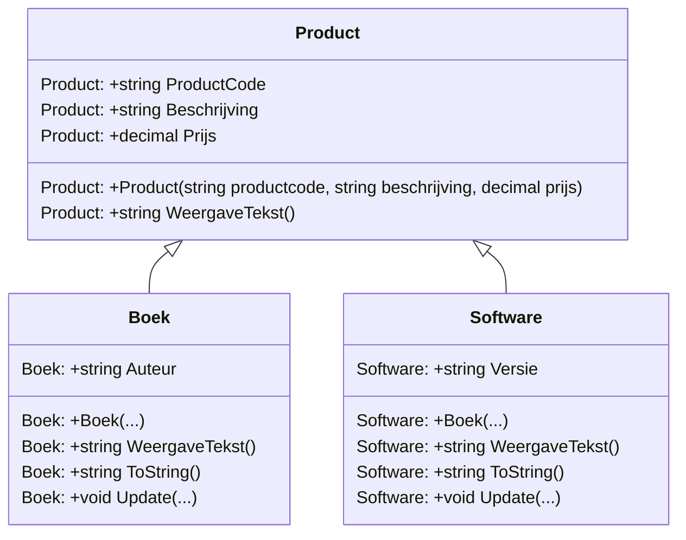

```mermaid
classDiagram

    class Product {
    Product: +string ProductCode
    Product: +string Beschrijving
    Product: +decimal Prijs
    Product: +Product(string productcode, string beschrijving, decimal prijs)
    Product: +string WeergaveTekst()
    }

    class Boek {
    Boek: +string Auteur
    Boek: +Boek(...)
    Boek: +string WeergaveTekst()
    Boek: +string ToString()
    Boek: +void Update(...)
    }

    class Software {
    Software: +string Versie
    Software: +Boek(...)
    Software: +string WeergaveTekst()
    Software: +string ToString()
    Software: +void Update(...) 
    }

    Product <|-- Boek
    Product <|-- Software
```
